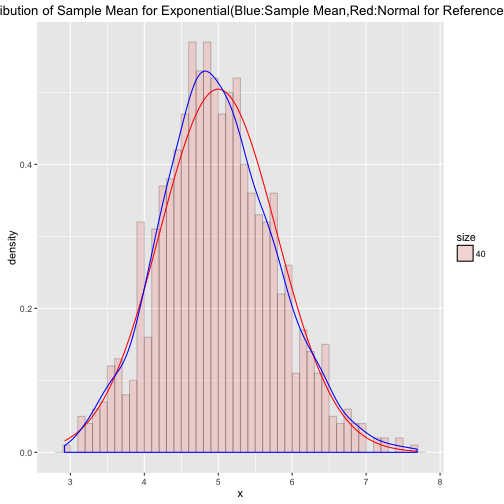

## Introduction to the Experiments Shiny App

The experiments shiny app is used to investigate simulation distributions in R and prove the correctness of Law of Large Numbers  ( LLN ) and Central Limit Theorem ( CLT ).

1. Law of Large Numbers  ( LLN ): It says that the average limits to what its estimating, the population mean. 
2. Central Limit Theorem ( CLT ): It states that the distribution of averages of iid variables becomes that of a standard normal as the sample size increases, like a bell curve.
The result is that $$\frac{\bar X_n - \mu}{\sigma / \sqrt{n}}= \frac{\sqrt n (\bar X_n - \mu)}{\sigma} = \frac{\mbox{Estimate} - \mbox{Mean of estimate}}{\mbox{Std. Err. of estimate}}$$ has a distribution like that of a standard normal for large $n$.
3. In the experiments shiny App, we can observe the results by choosing one of the simulation distributions ( Exponential ( lambda = 0.2 ) or Standard Normal ( mu = 0, sd = 1 ) ) and setting the different sample size ( n = 10 ~ 50, each simulation repeated 1000 times. )

--- .class #id 

## Experiment for the Law of Large Numbers  ( LLN )
Simulation: Exponential ( lambda = 0.2 ), Sample size: n = 20 ( R code running with echo = FALSE)

 

--- .class #id 

## Experiment for the Central Limit Theorem ( CLT )
Simulation: Exponential ( lambda = 0.2 ), Sample size: n = 40 ( R code running with echo = FALSE)

 

--- .class #id 

## Summary

In the experiments shiny App, results will be changed with different simulation distributions choosed as well as  different sample size selected.

1. The LLN experiment result shows that the sample mean will converge to theoretical mean. It proves that Law of Large Numbers  ( LLN ) is correct.

2. The CLI experiment result shows that the variance of the average of samples will become less with the increaing sample size, and it will converge to theoretical variance / sample size, and the distribution of average of samples is approximately normal, as a bell curve. It proves that Central Limit Theorem ( CLT ) is correct.

